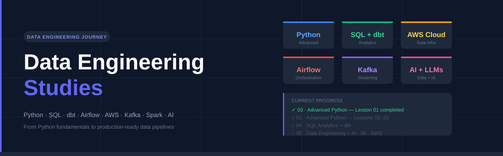

# Data Engineering Studies

> Personal learning repository documenting my journey to become a Data Engineer — following the **Data Engineering Roadmap** by [Luciano Galvão](https://github.com/lvgalvao/data-engineering-roadmap).


---

## 📌 About

This repository documents my hands-on studies in data engineering — from advanced Python fundamentals to production-ready data pipelines, cloud infrastructure, and AI integration. Every lesson, exercise, and project is committed here as I progress through the roadmap.

---

## 🗺️ Roadmap Progress

### 00 · Immersion
| Topic | Status |
|-------|--------|
| Introduction to Data Engineering | ✅ Done |

---

### 01 · Practical Projects
| Project | Status |
|---------|--------|
| Data Project Foundations | ⬜ Not started |
| Python Big Data Processing (1 billion rows) | ⬜ Not started |
| CRUD API Data Application (FastAPI + PostgreSQL) | ⬜ Not started |
| Data Quality Engineering (DuckDB) | ⬜ Not started |
| SQL Advanced Analytics (Northwind) | ⬜ Not started |
| Web Scraping NoSQL Pipelines (Redis + MongoDB) | ⬜ Not started |
| PDF Data Extraction (S3 + SQS) | ⬜ Not started |
| Databricks Data Modeling (Bronze-Silver-Gold) | ⬜ Not started |
| Databricks AI Project (LangChain + Vector Search) | ⬜ Not started |

---

### 02 · Data Fundamentals
| Topic | Status |
|-------|--------|
| Git and GitHub | ✅ Done |
| Application Deploy | ⬜ Not started |
| WSL Environment Setup | ⬜ Not started |

---

### 03 · Advanced Python for Data
| Lesson | Topic | Status |
|--------|-------|--------|
| Lesson 01 | Basics and User Input | ✅ Done |
| Lesson 02 | Data Types and Type Conversion | ⬜ Not started |
| Lesson 03 | Conditionals and Control Flow | ⬜ Not started |
| Lesson 04 | Loops and Iteration | ⬜ Not started |
| Lesson 05 | Functions and Scope | ⬜ Not started |
| Lesson 06 | Lists and Tuples | ⬜ Not started |
| Lesson 07 | Dictionaries and Sets | ⬜ Not started |
| Lesson 08 | File Handling and I/O | ⬜ Not started |
| Lesson 09 | Error Handling and Exceptions | ⬜ Not started |
| Lesson 10 | Object-Oriented Programming | ⬜ Not started |
| Lesson 11 | Modules and Packages | ⬜ Not started |
| Lesson 12 | List Comprehensions and Generators | ⬜ Not started |
| Lesson 13 | Decorators and Context Managers | ⬜ Not started |
| Lesson 14 | Working with APIs | ⬜ Not started |
| Lesson 15 | Data Processing with Pandas | ⬜ Not started |
| Lesson 16 | ETL Pipelines | ⬜ Not started |
| Lesson 17 | Logging and Monitoring | ⬜ Not started |
| Lesson 18 | Testing in Python | ⬜ Not started |
| Lesson 19 | Advanced Data Structures | ⬜ Not started |
| Lesson 20 | Final Project | ⬜ Not started |

---

### 04 · SQL Analytics + dbt Core
| Topic | Status |
|-------|--------|
| Advanced SQL for Analytics | ⬜ Not started |
| dbt Core — Fundamentals | ⬜ Not started |
| dbt Core — Transformations | ⬜ Not started |
| dbt Core — Testing and Documentation | ⬜ Not started |
| dbt Core — Deployment | ⬜ Not started |
| Databricks SQL Analytics | ⬜ Not started |

---

### 04b · Workflow Orchestration — Airflow
| Topic | Status |
|-------|--------|
| Airflow — Introduction | ⬜ Not started |
| Airflow — DAGs and Operators | ⬜ Not started |
| Airflow — Advanced Concepts | ⬜ Not started |
| Airflow — Deploy and Production | ⬜ Not started |

---

### 05 · Data Engineering + AI
| Topic | Status |
|-------|--------|
| REST APIs with FastAPI | ⬜ Not started |
| Kafka and Pub/Sub — Real-time Streaming | ⬜ Not started |
| Real-time Dashboards with Streamlit | ⬜ Not started |
| Infrastructure as Code with Terraform | ⬜ Not started |
| AI Integration in Data Pipelines | ⬜ Not started |
| RAG, Vector Search and LangChain | ⬜ Not started |

---

### 06 · Cloud AWS for Data
| Topic | Status |
|-------|--------|
| S3 — Object Storage | ⬜ Not started |
| EC2 — Compute | ⬜ Not started |
| RDS — Managed Databases | ⬜ Not started |
| Lambda — Serverless Functions | ⬜ Not started |
| VPC and IAM — Security and Networking | ⬜ Not started |
| SQS and SNS — Messaging | ⬜ Not started |
| API Gateway | ⬜ Not started |
| DynamoDB — NoSQL | ⬜ Not started |
| Amplify — Frontend Deploy | ⬜ Not started |
| Integrated Data Projects on AWS | ⬜ Not started |

---

## 📁 Repository Structure

```
data-engineering-studies/
├── 03-advanced-python-for-data/
│   └── 01-basics-and-user-input/
│       ├── 00_hello_world.py
│       ├── 01_name_length.py
│       ├── 02_sum_calculator.py
│       ├── 03_sum_calculator_refactored.py
│       ├── 04_challenge_bonus_calculation.py
│       └── 05_challenge_bonus_calculation_fixed.py
├── banner.svg
└── README.md
```

---

## 🛠️ Technologies covered throughout the journey

- **Languages:** Python, SQL
- **Data Tools:** dbt Core, Apache Airflow, Apache Kafka, Apache Spark
- **Databases:** PostgreSQL, DuckDB, MongoDB, Redis, DynamoDB
- **Cloud:** AWS (S3, EC2, RDS, Lambda, SQS, SNS, API Gateway)
- **AI/ML:** LangChain, RAG, Vector Search, LLM integration
- **Infrastructure:** Terraform, Docker, Databricks
- **Visualization:** Streamlit
- **APIs:** FastAPI

---

## 📚 Reference

This roadmap is based on the **Data Engineering Professional Training** by [Luciano Galvão — Jornada de Dados](https://github.com/lvgalvao/data-engineering-roadmap).

---

👨‍💻 **Author:** Tales Manfredine Ferreira Lopes — Computer Science Student | Aspiring Data Engineer
